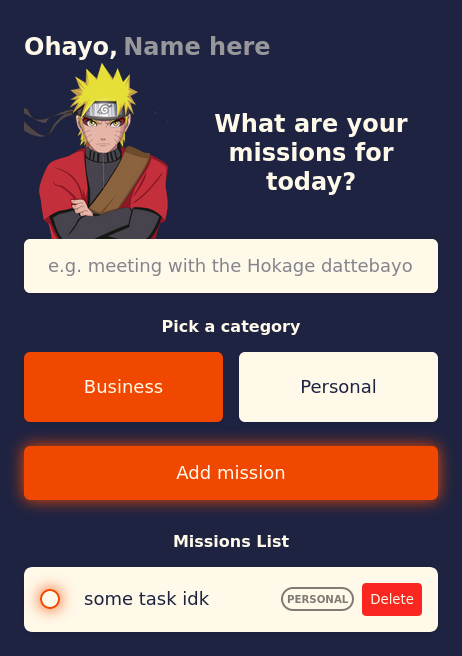
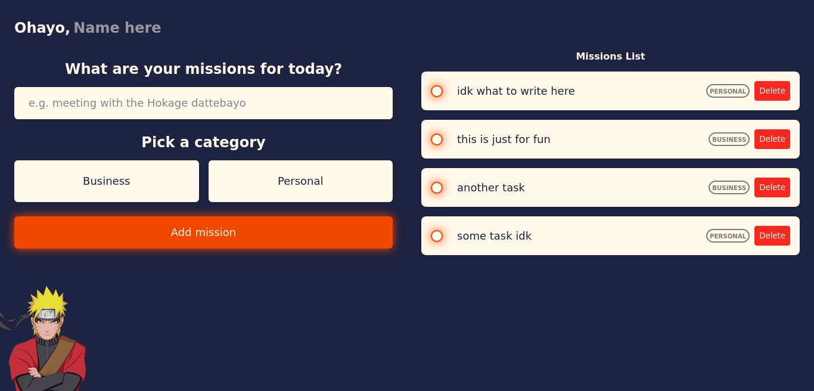

# Shinobi Tasks

### Just for practicing I made a simple to-do app.

**Technologies used:**

- Vue 3 (router included)
- Vite
- Sass

> It also uses the local storage for saving the changes in your list.

**Last update:**

- Fixed the Sass folder structure.
- Minor changes in Sass code.
- Added task category indicator.
- Changed the color palette.

## Screenshots

_Phone View_

_Desktop View_
